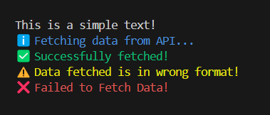
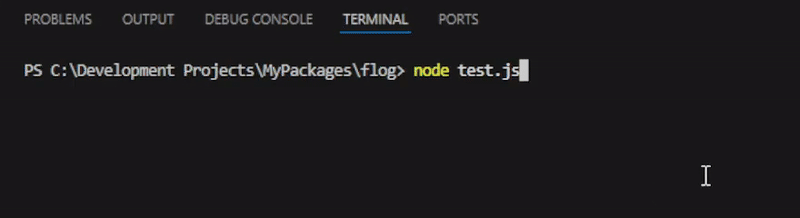
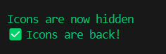

# flog — Minimal and Styled Console Logger ✨

`flog` is a lightweight, zero-dependency console logger that lets you style terminal output using ANSI codes with ease. Think of it as a minimalist alternative to `chalk`, but with smart helpers and presets.

---
## ✨ Features

- 🔹 **Premade shortcuts**: `flog.success()`, `flog.info()`, `flog.warn()`, `flog.error()`
- 🎨 **Custom styles**: Use `flog.style()` to apply multiple ANSI styles, foregrounds, backgrounds
- 🟦 **Supports**: `hex`, `bgHex`, `rgb`, `bgRgb` for true color output
- 🧩 **Presets**: Create reusable styles with `flog.addPreset('name', 'style')`
- ⚙️ **Smart Loading**: Visualize promise waiting using `flog.loader()`.
- 🪶 Zero dependencies & Lightweight

---

## 📦 Installation

```bash
npm install @akhilx/flog
```

---

## 🚀 Quick Start

```ts
import flog from '@akhilx/flog';

// Built-in styles
flog('This is a simple text!')
flog.info('Fetching data from API...');
flog.success('Successfully fetched!');
flog.warn('Data fetched is in wrong format!');
flog.error('Failed to Fetch Data!');
```



If you're using CommonJS:

```js
const flog = require('@akhilx/flog').default;
```

## 💫 Promise Spinners and Loaders

```ts
//Use Spinners to wait for single promise
flog.loader(fetch('api.example.com'),'Waiting for response.');
flog.loader(fetch('api.example.com'), 'Waiting for response', 'Response Received', 'Request Failed'); //Custom success and fail messages.
// ⚠️ Do not use await while passing promise to loader function. flog.loader(await fetch...) ❌

//Using multiple promises for Percentage Animation
const responses = await flog.loader([
    fetch('api.example.com'),
    fetch('api.example2.com'),
    updateDb(data),
    //Other operations
], 'Updating Data...');
console.log('Responses:', responses);
```



---

## 🎨 Advanced Usage with `flog.style(...)`

Apply one or more styles using keywords:

```ts
flog.style('red underline', 'Styled message');
flog.style('bgBlue bold', 'Important alert');
flog.style('blue bgYellow italic', 'Color combo!');
```



### ✅ Supported styles (partial)

| Category          | Examples                                         |
| ----------------- | ------------------------------------------------ |
| Text Styles       | `bold`, `dim`, `italic`, `underline`, `blinking` |
| Foreground Colors | `red`, `blue`, `green`, `yellow`, etc.           |
| Background Colors | `bgRed`, `bgBlue`, `bgWhite`, etc.               |

---

### 🎨 Hex & RGB Support

Use full 24-bit color via `hex`, `bgHex`, `rgb`, `bgRgb` syntax:

```ts
flog.style('hex-[#ff6347]', 'Tomato Red Text');
flog.style('bgHex-[#1e90ff]', 'Dodger Blue BG');

flog.style('rgb-[220, 20, 60]', 'I like Crimson');
flog.style('bgRgb-[66,245,161]', 'What is this color?');
```

*Syntax:*

* `hex-[#<hexcode>]` → foreground
* `bgHex-[#<hexcode>]` → background
* `rgb-[r,g,b]` → foreground
* `bgRgb-[r,g,b]` → background

---

## 📦 Add Custom Presets

Define your own style shortcuts:

```ts
flog.addPreset('danger', 'red bold underline');
flog.danger('This is dangerous!');
```

---

## ⚙️ Icon Toggle

Icons (✅, ℹ️, ⚠️, ❌) are shown by default in the built-in functions. You can disable them if needed:

```ts
flog.disableIcons();
flog.success('Icons are now hidden');

flog.enableIcons();
flog.success('Icons are back!');
```

---

## 📚 API Reference

| Method                         | Description             |
| ------------------------------ | ----------------------- |
| `flog(...args)`                | Plain logger (no style) |
| `flog.success(...args)`        | Green ✅ message         |
| `flog.info(...args)`           | Blue ℹ️ message         |
| `flog.warn(...args)`           | Yellow ⚠️ message       |
| `flog.logger(Promise \| Promises[], msg...)`          | Promise Spinner or loaders           |
| `flog.error(...args)`          | Red ❌ message           |
| `flog.style(styles, ...args)`  | Apply multiple styles   |
| `flog.addPreset(name, styles)` | Add custom logger       |
| `flog.disableIcons()`          | Turn off emojis         |
| `flog.enableIcons()`           | Re-enable emojis        |

---

## 📄 License

MIT © [Akhil](https://github.com/AkhilTrivediX)

---

## 🌟 Star & Help building this repo

If you find this useful, please ⭐️ the repo:
[https://github.com/AkhilTrivediX/flog](https://github.com/AkhilTrivediX/flog)

